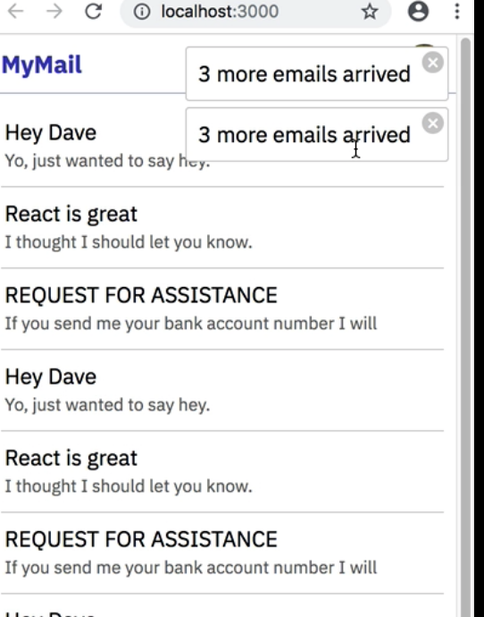
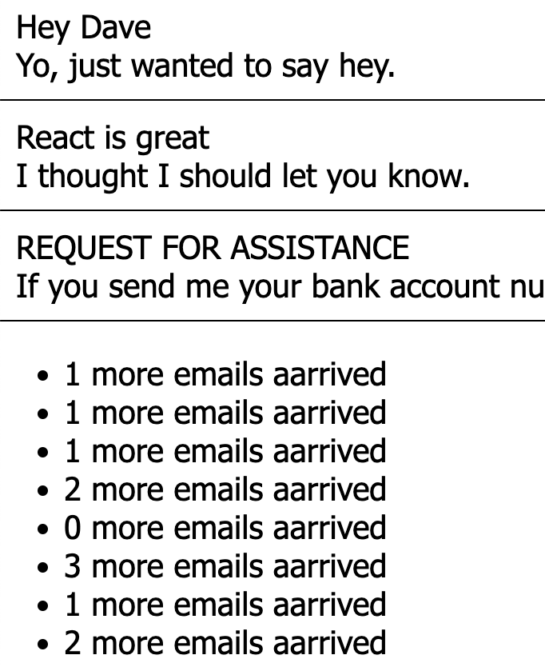

# 35-teach-me-react-context-with-hooks-2023

# New react context in react@16.3

## What is context?

- Context is an object that provides a way to pass data through the component tree without having to pass props down manually at every level.
- Context is designed to share data that is considered "global" for a tree of React components.

## Why statement management is tough ?

- React state is easy to get started with. But passing props down multiple levels through the component tree is painful and cumbersome. Why is it painful ? [Look at the example of why Redux](https://blog.logrocket.com/why-use-redux-reasons-with-clear-examples-d21bffd5835/).

- My explaination why react state is painful.

  1. Less predictable. We have to keep moving the common state up the hierarchy making it less predictable.
     Problem manifests with React State, when in an App, same state is shared by multiple components. If they are just siblings with one parent, we can hold the common state in the parent (as the data should live in only one component) and pass the state as props to the child components. Now imagine what happens when a state has to be shared between components that are far apart in the component tree. The state has to be passed from one component to another until it gets to where it is needed. Basically, the state will have to be lifted up to the nearest parent component and to the next until it gets to an ancestor that is common to both components that need the state and then it is passed down. This makes the state difficult to maintain and less predictable.

  2. Passing data to componentas that do not use them. Also, a known problem with this scenario is that we have to keep pasing the props to intermediate components that do not use them directly. They just pass them further down for others to use them.

## Redux

- Redux is predictable state container for javascript applications.
- Redux is popular. But it comes with :
  1. Its own complexity, deep learning curve.
  2. For many projects, its over kill.

## React Context

- Context is a middle ground.
- Context is what react uses under the hood to pass data around.

### Current Step:

Step: step6
<br />
Branch: 6-inter-context-communication

#### Problems with step5

- So far, Email data is static. We want to make it dynamic. As new emails come, we want to show App level notifications.
- So far we did not illustrate context to context communication. Lets see that in next step.

#### step6. Lets see how multiple contexts communicate with each other.

- A common kind kind of "global" data is a toast or popup notification that appears in the corner of the app when some event happens. Allowing a deeply nested component to surface a notification to the root of the app is painful as a callback has to be passed from root level to the deeply nested component. Using a context makes it easier. In this step, we will see how to dispatch a notification from deeply nested component and display it at the root level.

#### step6.1 lets retrieve email every 5 seconds.

- But big learning, setInterval() within useEffect is creating a stale closure.
```js
    // fetch all email on componentDidMount
    useEffect(() => {
        setIsLoading(true);
        setError(false);
        fetchEmails().then((_emails) => {
            setIsLoading(false);
            setEmails(_emails);
        });
        refreshInterval = setInterval(() => {
            fetchLatestEmails().then((newEmails) => {
                setEmails(emails.concat(newEmails)); // emails is always [] due to stale closure in useEffect. Its a standard problem in React hooks.
            });

        }, 3000);

    }, []);
```
- Main fix is in the way how we call setState or setEmails here.
##### Fix. setState to the rescue. We can use second signature. setState(prevState => newState). This one will always fetch the latest previous state instead of closure captures value.
```js
    // fetch all email on componentDidMount
    useEffect(() => {
        setIsLoading(true);
        setError(false);
        fetchEmails().then((_emails) => {
            setIsLoading(false);
            setEmails(_emails);
        });
        refreshInterval = setInterval(() => {
            fetchLatestEmails().then((newEmails) => {
                setEmails(emails => emails.concat(newEmails)); // Correct way. Use second signature for setState. That fetches the latest previous state instead of using the value captured by stale closure passed to setInterval.
            });

        }, 3000);

    }, []);
```

#### step6.2 We need to display notification messages.
- For example:


- Idea is very simple. Wrap App with NotificationProvider.
```js
<NotificationProvider><App /> </NotificationProvider>
```
- And have notification provider has 2 responsibilities:
    - Provides callback: notify() method for Email client (in this case, EmailProvider) to notify it of new emails.
    - It will render notifications using:
    ```html
    <ul><li><li></ul>
    ```

- My first try:
    1. Wrap EmailProvider with NotificationConsumer and have EmailProvider access its .notify() method and pass the message.
```js
// in EmailProvider.js
//...
refreshEmails = () => {
  api
    .fetchLatestEmails()
    .then(emails => {
      this.setState({
        isLoading: false,
        emails: this.state.emails.concat(emails)
      });
      // This is the point I need access to NotificationContext's notify method ==> (1)
    })
    .catch(error => {
      this.setState({ isLoading: false, error });
    });
};
//...
render() {
    return <NotificationConsumer>
        {({notify})=>( //<============PROBLEM. I ideally want this to be passed to ==> Line (1). Not possible.
        <Provider value={{
            ...this.state,
            onSelectEmail: this.handleSelectEmail
            }}>
        {this.props.children}
        </Provider>
        )}
    </NotificationConsumer>;
}
```
- The point is EmailProvider has to invoke method, notify(), shared by NotificationProvider.
- So EmailProvider has to extract it from NotificationConsumer.
- Did 4 mistakes in NotificationContext
```js
import React, { useState } from 'react';

// Mistake1: Dont use React.useContext(). Call React.createContext().
const { Provider, Consumer } = React.createContext();

const NotificationProvider = (props) => {
    const [messages, setMessages] = useState([]);
    const notify = (msg) => {
        // Mistake4. First signature setMessages(newState) doesnt work.
        // stale closure issue.
        // Learning. Only 2nd signature setMessages(prevState => newState) ONLY work.
        setMessages(messages => messages.concat(msg));
    }
    return <Provider value={{
        notify
    }}>
        {/* Mistake3: Forgot to add props.children */}
        {props.children}
        <ul className="notification-wrapper">
            {
                messages.map(eachMessage => <li key={eachMessage.id} className="notification">
                    {eachMessage.text}
                </li>)
            }
        </ul>
    </Provider>;
}

// Define a HOC
// Mistake2: Tried directly returning an element than returning a function.
export const enhanceWithNotifier = (InputComponent) => (props) => {
    return <Consumer>
        {({ notify }) => <InputComponent {...props} notify={notify} />}
    </Consumer>;
}


export { NotificationProvider, Consumer as NotificationConsumer };

```

#### step6.3. We need to display notification messages at top right corner of the window

### Previous Step:

Step: step5
<br />
Branch: 5-multiple-context-providers

#### Problems with step4

- So far we illustrated only one context provider. In real world, we may have unrelated kinds of data which may not come form single context.

#### step5. Lets use multiple React Context Providers in the Same App.

When you have two unrelated kinds of data such as a current user and a currently-selected email, it’s common for some parts of the app to need the user and some other parts of the app to need the email. One way to do this is to create multiple Contexts, each with its own Provider and Consumer, and use each one to distribute one kind of data to the slices of the app that need it. In this lesson we’ll pass user data and email data to separate subtrees using two separate Contexts.

- We will have following state for EmailContext that is exposed in the EmailContext:
    - emails (that we load from api.js)
    - currentEmail (is consumed by MainPage to switch between MessageViewer and MessageList)
    - isLoading (is consumed by MainPage)
    - error
- We will also expose a callback to the components that let them change the context:
    - onSelectEmail

## Current Step:
Step: step4
<br />
Branch: 4-encapsulate-and-centralize-sharable-data-and-methods

### Problems with step3

- Single Responsibility Principle is broken for App.
  So far, App is responsible for defining currentUser, onLogin, onLogout. But they are being shared from UserContext. In future, App may become responsible for sharing theme, language setting etc., which is not what we want. We dont want App to get messy.

- Lack of encapsulation.
  App knows all the implementation details of what the provider is providing although it doesnt consume directly.

- Let each ContextProvider own and define what it want to share. Move that data (currentUser) + methods (onLogin, onLogout) out of App.

### step3. Use React Context to avoid passing callbacks deeply into the component tree.


## Previous Step:
Step: step3
<br />
Branch: 3-use-context-to-share-callbacks

### Problems with step2

- Callbacks are being passed multiple levels down through intermediate components to deeply nested child components, without intermediate components actually using them.

### step3. Use React Context to avoid passing callbacks deeply into the component tree.


## Previous Step:

Step: step2
<br />
Branch: 2-use-context-to-share-data

### Learnings: Step2. Use React Context to avoid passing props deeply into the component tree.


## Previous Step:

Step: step1
<br />
Branch: 1-without-context

### Learnings: Step1. Lets build a simple User Login and inbox without context.

- In UserMenu.js, I have to display a rounded avatar image, on clicking which i need to display a menu.


- Mistake1: I have assigned avatarRef to div parent
```js
    return <div className="UserMenu" ref={avatarRef} >
        
        ...
    </div>;
```
- If so, this check will fail as e.target will be  tag. Not its parent <div>
```js
    const handleClick = (e) => {
        if (e.target !== avatarRef.current) {
            dispatchIsMenuVisible({
                type: HIDE_MENU,
            });
        }
    }
```
- So correct way is to assign the ref to  tag:
```js
    return <div className="UserMenu" >
        
        ...
    </div>;
```

- Learning2: Always set list-style to ul. Not on li.
    - .UserMenu -> set display: flex, align-iotems: center; position: relative;
    ```css
        /* UserMenu */
        .UserMenu {
            display: flex;
            align-items: center;
            position: relative;
        }

        .UserMenu ul {
            list-style: none;
            margin: 0;
            padding: 5px;
            position: absolute;
            top: 35px;
            right: 5px;
            background-color: #fff;
            box-shadow: 0 1px 3px 3px rgba(0, 0, 0, 0.5);
        }

        .UserAvatar {
            border-radius: 50%;
            border: 1px solid red;
        }

    ```

- Learning3: Returning a promise that resolves to FAKE_USER in login() method in services/api.js.

- Learning4: currentUser is being passed from LoginPage -> App -> Header -> UserMenu
    1. App <- LoginPage
    2. App -> Header -> UserMenu
    3. App -> MessageList
    - This works okay. But we pass currentUser to bunch of components (eg. MainPage, Header ) that dont care about it.
- One way we can clean it up is React Context which we can explore in next step.
